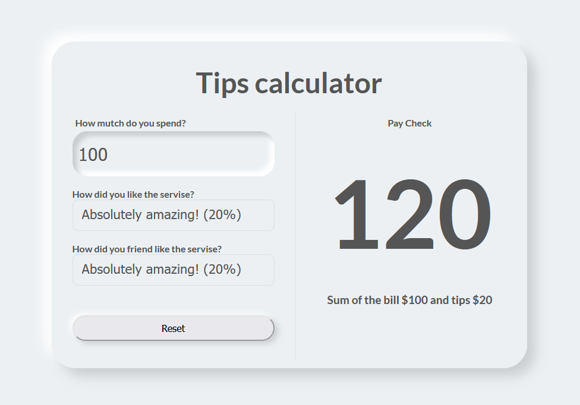

# Thi is simple Tips Calculator app

Created for mastering state, props and child props in React.

## External view

This component is built with [create-react-app](https://github.com/facebook/create-react-app).
It allows you to calculate tips and the final bill, particularly useful after a dinner at a restaurant with a friend. The final bill is determined by considering the satisfaction levels of both you and your friend.
